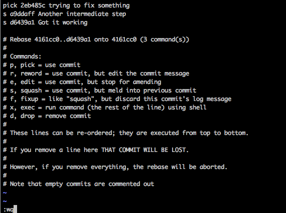

+++
date = "2016-03-24T22:24:54-08:00"
draft = false
title = "Squashing Commits With Git Rebase: A Very Quick Guide"
slug = "squashing-commits-with-git-rebase-guide"
disqus_url = "http://blog.benjamin-encz.de/post/squashing-commits-with-git-rebase-guide/"
+++

Git's interactive rebase is extremely useful for keeping a somewhat clear commit history. Here's a very brief guide on how to squash multiple commits into a single one.

<!--more-->

Git rebase allows you to rewrite the history of a git repository. **Yes, you are right, this can be incredibly dangerous, therefore don't use this technique on branches that are shared with other developers**. To me rebase is most useful for preparing a branch that is about to be merged into the main branch of a project.

Let's assume our branch's commit log is in the following state (printed by using `git log`):


We have a bunch of intermediate commits for stages in which our code was not working as expected ending with a commit that indicates that our feature/bug fix is complete.

Having all of these commits in the history of a project would mean that the commit log would quickly become very difficult to read.

Git rebase allows us to turn these 3 intermediate commits into a single one.

The following command will bring you into git's interactive rebase mode:

```
git rebase -i HEAD~3
```

There are different ways to choose the range of commits you want to rebase. I mostly end up using `HEAD~N` to rewrite the latest `N` commits.

This will bring up the following screen:


You can now see the 3 commits you are about to rewrite. There are many different commands available, we are only going to use `squash` for now.

Type an `s` for `squash` in front of the commits that you want to squash together. In our example we choose the final commit along with one intermediate commit to be squashed into the first intermediate commit (this will turn 3 commits into one):



Then close the text editor. Next, git will bring up a screen that will allow you to choose some details for each rebasing step. In our example we only have a single step - the one in which we merge 3 commits into one.

Git will allow you to change the commit message for this new squashed commit. It starts out by showing you the messages of all commits it is about to squash:


Now you can choose a new, descriptive, commit message:


Close the text editor by saving, and you're done. If you take a look at the new commit history via `git log`, you should see the following output:


A clean commit history that is ready to merge!
