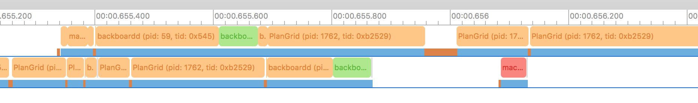
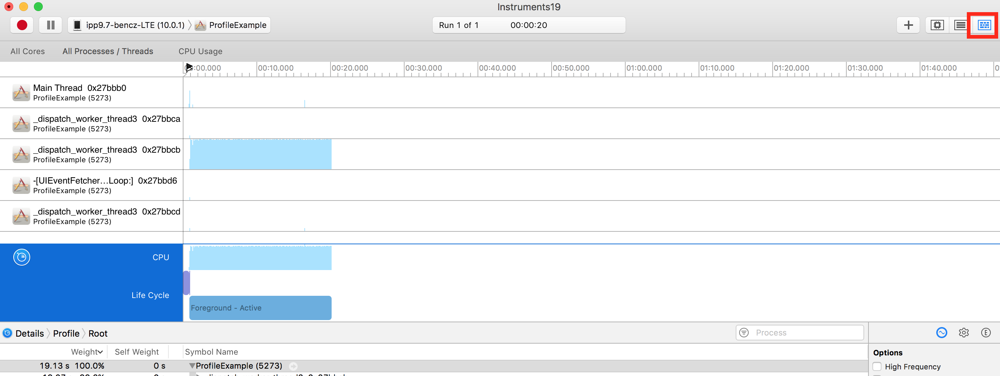

+++
date = "2017-03-05T22:24:54-08:00"
draft = false
title = "Surprises in Profiling Multi-Core Performance with Instruments"
slug = "profiling-multicore-performance-instruments"
disqus_url = "http://blog.benjamin-encz.de/post/profiling-multicore-performance-instruments/"
+++

**Short version:** When profiling code that should run on multiple cores in parallel, CPU utilization of multiple cores isn't a good indicator as a single thread might utilize multiple cores at (almost) the same time.

<!--more-->

----

It's rare that iOS apps need to optimize code to run in parallel. Usually the only performance concern is to not block the UI thread. 

Our team just completed a large data migration in which we could significantly improve performance by running code in parallel on multiple cores. On the way I learnt a few interesting details about Instruments and ARM processors that felt worth sharing.

## Switch Core, Switch

When I started profiling the code with the Time Profiler instrument I noticed that a single thread was using almost 100% of CPU time. This indicated that the task was CPU bound and potentially could be sped up if I could parallelize some parts of the required work.

In it's guide [*Measure CPU Use*](https://developer.apple.com/library/content/documentation/DeveloperTools/Conceptual/InstrumentsUserGuide/MeasuringCPUUse.html), Apple recommends using a special view in Time Profiler that breaks down the utlization of individual cores.

> Use the CPU strategy usage view to compare core usage over given time periods. Effective core concurrency improves an app’s performance. Look for unbalanced core usage. If a single core has areas of heavy usage while other cores remain quiet, that can indicate areas that need greater optimization.

For the purpose of this blog post I built a very simple app that performs a CPU heavy task.

Here's the Time Profiler trace of that example app, the worker thread consumes almost 100% of CPU time.:

Surprisingly, the *CPU Data* View shows a graph that suggests that this code is already executing across both cores of my iPad Pro:

I knew that a single thread could not be executed in parallel. Reading the guide more closely would have saved me a few minutes of confusion:

> When zoomed out, activity may appear to be occurring on multiple threads, but a closer inspection may reveal otherwise. Therefore, be sure to zoom in on the track pane when examining core usage.

Indeed, zooming in very far, reveals that execution of the main thread jumps between both cores, but never happens in parallel on both cores: 

The System Trace instrument provides a more detailed breakdown of which processes are being executed on which core. This screenshot shows the example app process (highlighted with red boxes) jumping between both cores:

## More Interrupts, More Core Bouncing

Since the migration code in the PlanGrid app was not entirely CPU bound, but was also interacting with our local DB we would see a lot more interrupts and as a result a lot more core switches:

I was surprised to learn about these frequent core switches, since my understanding was that they incur a fairly high performance overhead. A technology called [*Symmetric Multi-Processing*](http://infocenter.arm.com/help/index.jsp?topic=/com.arm.doc.den0024a/ch14s01s02.html) (SMP) eliminates that overhead by using memory that is shared across all cores of a multi-chip system.

>  Each core in the cluster has the same view of memory and of shared hardware. Any application, process, or task can run on any core and the operating system scheduler can dynamically migrate tasks between cores to achieve optimal system load. A multi-threaded application can run on several cores at once. The operating system can hide much of the complexity from applications.

Apparently SMP is standard on all modern chips.

## Profiling Parallel Execution The Right Way

**As shown above, core utilization isn't a great way to measure whether or not your code is running efficiently accross multiple cores.** 

The *Thread Data* view in the Time Profiler instrument is a lot more useful for that. It clearly shows that the entire work for the sample project is bound to single thread - which means it cannot be executed in parallel:

Here's what the graph above looks like when **changing the sample project to run parts of the work parallel**:

The graph now shows a CPU utilization of over 100% and indicates that the work is performed on two different threads in parallel.

The system trace will now also reveal that the code is running in parallel on two cores:

If you profile parallelized code that involves locking you should also [make sure to turn on the *Record Waiting Threads* option in the Time Profiler](https://www.bignerdranch.com/blog/rock-heads/).

Concurrency is hard - but parallelism might be harder?

---

Also, did you know that the [A8X processor](https://en.wikipedia.org/wiki/Apple_A8X) of the iPad Air 2 has three cores? I didn't until I found out through profiling!